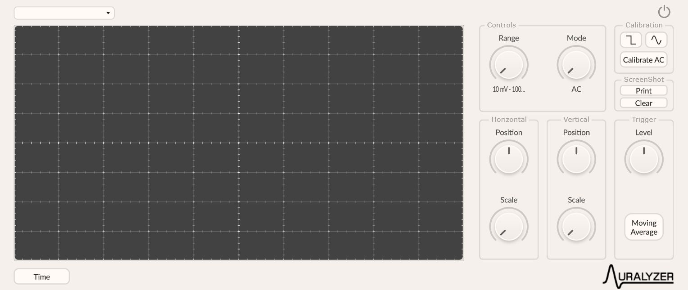
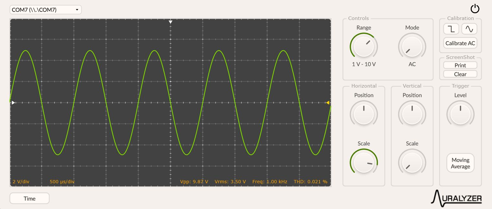
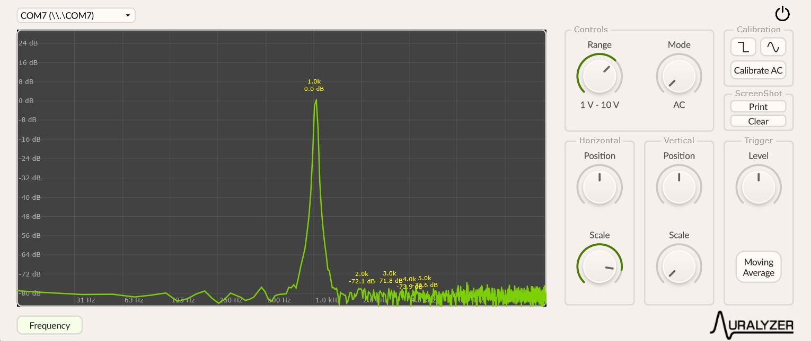
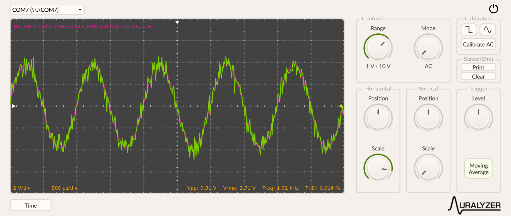

# Auralyzer

## 

**Auralyzer** acts as the control and visualization core of the digital oscilloscope system. It receives digitized analog signals through an audio interface and enables real-time graphical representation in both the time and frequency domains. The graphical interface provides intuitive controls to adjust scale and position, configure coupling mode (AC/DC), select measurement ranges, and set trigger parameters to stabilize the waveform. It also computes automatic metrics such as peak-to-peak voltage, RMS value, and fundamental frequency.

Additionally, the plugin communicates via serial port with an ESP32 to manage the state of digital switches that control the input blocks of the physical system. This communication allows switching between a software-controlled mode and a hardware-supervised mode, ensuring synchronization between visualization and actual configuration. It also integrates an automatic calibration function based on a reference signal generated from the audio board’s output, allowing scale factor adjustment to display real voltage values accurately.

## 

